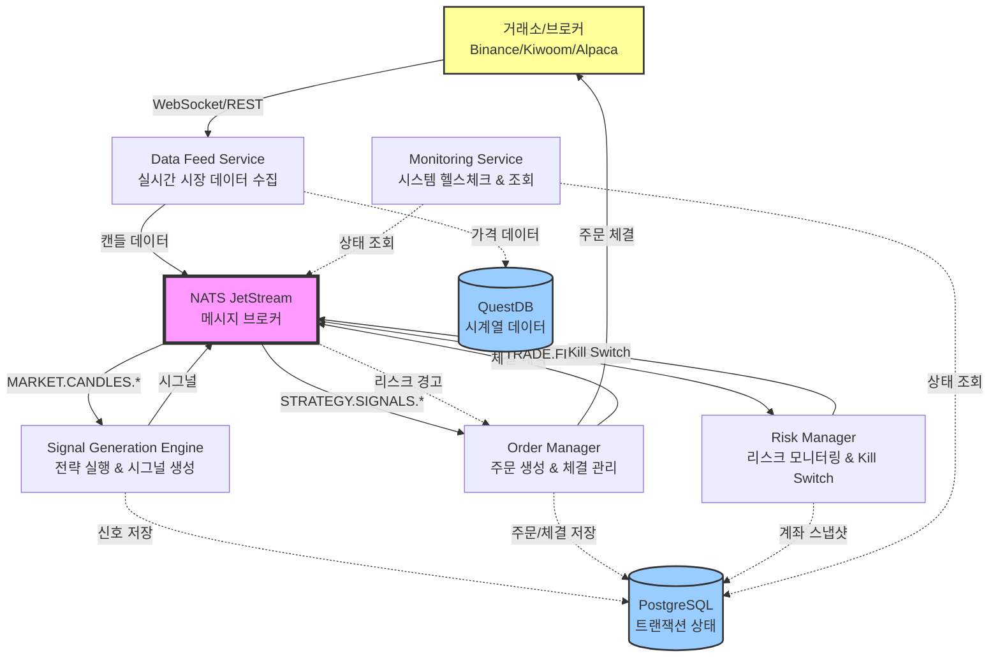

# VibeTrading - 프로덕션 그레이드 트레이딩 시스템

## 📋 프로젝트 개요

### 프로그램 설명
VibeTrading은 마이크로서비스 기반의 이벤트 드리븐 알고리즘 트레이딩 시스템입니다. 실시간 시장 데이터를 수집하고, 트레이딩 전략을 실행하며, 주문을 자동으로 체결하는 완전 자동화된 시스템입니다.

### 주요 목적
- **백테스팅**: 과거 데이터로 전략 검증 및 성과 분석
- **페이퍼 트레이딩**: 실제 시장 데이터로 모의 거래 수행
- **실전 트레이딩**: 실제 자금으로 자동 매매 실행
- **멀티마켓 지원**: 한국 주식, 미국 주식, 암호화폐 동시 운용

### 핵심 특징
1. **편향 없는 백테스팅**: Look-ahead bias를 철저히 방지하는 이벤트 드리븐 백테스팅 엔진
2. **마이크로서비스 아키텍처**: 서비스별 독립적 확장 가능
3. **통합 Fill Logic**: 백테스팅과 실전 거래에서 동일한 체결 로직 사용
4. **실시간 리스크 관리**: Kill Switch 및 자동 손실 제한 기능
5. **마켓별 격리**: KR/US/Crypto 시장별 독립적인 실행 환경
6. **전략 블랙박스화**: 전략 로직과 시스템 인프라의 완전한 분리

---

## 🏗️ 시스템 아키텍처

### 고수준 아키텍처 설명

시스템은 **메시징 기반 이벤트 드리븐 아키텍처**로 설계되었습니다. 각 마이크로서비스는 NATS JetStream을 통해 통신하며, 데이터는 PostgreSQL(트랜잭션)과 QuestDB(시계열)에 저장됩니다.

**핵심 흐름**:
1. **Data Feed** 서비스가 시장 데이터 수집 → NATS에 캔들 데이터 발행
2. **Signal Generation** 엔진이 캔들 구독 → 전략 실행 → 시그널 발행
3. **Order Manager**가 시그널 구독 → 주문 생성 → Broker를 통해 체결
4. **Risk Manager**가 체결 내역 구독 → P&L 계산 → 리스크 모니터링
5. Kill Switch 발동 시 모든 신규 주문 차단

### 아키텍처 다이어그램



### 주요 컴포넌트 상호작용

| 컴포넌트 | 역할 | 입력 | 출력 |
|---------|------|------|------|
| **Data Feed** | 시장 데이터 수집 | 거래소 WebSocket/API | NATS 캔들 이벤트 |
| **Signal Engine** | 전략 실행 | NATS 캔들 이벤트 | NATS 시그널 이벤트 |
| **Order Manager** | 주문 관리 | NATS 시그널 이벤트 | 거래소 주문 API 호출 |
| **Risk Manager** | 리스크 감시 | NATS 체결 이벤트 | Kill Switch 발동 |
| **PostgreSQL** | 상태 저장 | 주문/체결/포지션 | 트랜잭션 로그 |
| **QuestDB** | 시계열 저장 | 가격 데이터 | 백테스팅용 히스토리 |

---

## 📁 프로젝트 구조

### 디렉토리 개요

```
VibeTrading/
├── backtest/           # 백테스팅 엔진
├── docs/               # 설계 문서
├── scripts/            # 유틸리티 스크립트
├── services/           # 마이크로서비스 모듈
│   ├── data_feed/      # 시장 데이터 수집
│   ├── execution/      # 주문 체결 관리
│   ├── monitoring/     # 시스템 모니터링
│   ├── risk_engine/    # 리스크 관리
│   └── signal_gen/     # 시그널 생성
├── shared/             # 공유 라이브러리
└── strategies/         # 트레이딩 전략
```

---

### 📂 backtest/ - 백테스팅 엔진

**목적**: 과거 데이터로 전략을 검증하고 성과를 측정하는 시뮬레이션 환경

#### `__init__.py`
- 백테스팅 모듈 초기화 파일
- 패키지 export 정의

#### `data_loader.py`
**목적**: 백테스트용 과거 캔들 데이터 로딩

**주요 클래스/함수**:
- `BacktestDataLoader`: QuestDB 또는 로컬 파일에서 과거 데이터 로드
- `create_candle_provider()`: 마켓별 캔들 데이터 제공자 생성

**상호작용 파일**:
- `shared/database.py` (QuestDB 접근)
- `shared/models.py` (Candle 모델)

**사용 시나리오**:
- **사용자**: 백테스팅 실행자
- **목적**: 2020-01-01부터 2023-12-31까지 BTC 데이터 로드
- **입력**: `symbols=['BTCUSDT'], start_date='2020-01-01', interval='1d'`
- **출력**: 정렬된 Candle 객체 이터레이터

#### `engine.py`
**목적**: 이벤트 드리븐 백테스팅 엔진 (Look-ahead bias 방지)

**주요 클래스/함수**:
- `BacktestEngine`: 메인 백테스팅 실행 엔진
- `BacktestConfig`: 백테스트 설정 (심볼, 기간, 초기 자금)
- `BacktestResult`: 성과 지표 (수익률, 샤프 비율, MDD)
- `TradeRecord`: 개별 거래 기록
- `engine.run()`: 백테스트 실행 및 결과 계산

**내부 흐름**:
1. 캔들을 시간 순서대로 하나씩 처리
2. 각 캔들에서 전략 실행 (`SignalGenerationEngine.process_candle_sync()`)
3. 시그널 발생 시 포지션 오픈/클로즈
4. Fill Logic으로 체결가 시뮬레이션
5. 모든 캔들 처리 후 성과 지표 계산

**상호작용 파일**:
- `services/signal_gen/engine.py` (전략 실행)
- `shared/fill_logic.py` (체결 시뮬레이션)
- `services/execution/broker_stub.py` (모의 브로커)

**사용 시나리오**:
- **사용자**: 트레이더/전략 개발자
- **목적**: Turtle Breakout 전략의 과거 성과 검증
- **입력**: 전략명, 심볼 목록, 기간, 초기 자금 $100,000
- **출력**: 총 수익률 +45.2%, 샤프 비율 1.85, MDD 12.3%, 거래 횟수 127회

#### `walk_forward.py`
**목적**: Walk-forward 검증으로 과적합 방지

**주요 클래스/함수**:
- `WalkForwardValidator`: In-sample/Out-of-sample 검증
- `WalkForwardConfig`: 검증 설정 (IS 기간, OOS 기간)
- `generate_report()`: 검증 결과 리포트 생성

**내부 흐름**:
1. 전체 기간을 In-sample + Out-of-sample 윈도우로 분할
2. In-sample 기간으로 전략 최적화 (현재는 고정 파라미터)
3. Out-of-sample 기간으로 성과 검증
4. 윈도우를 슬라이딩하며 반복
5. 모든 OOS 결과를 취합하여 통계 계산

**상호작용 파일**:
- `backtest/engine.py` (각 윈도우별 백테스트)
- `backtest/data_loader.py` (기간별 데이터 로드)

**사용 시나리오**:
- **사용자**: 전략 검증자
- **목적**: 전략이 과적합되지 않았는지 검증
- **입력**: IS 252일, OOS 63일, 스텝 63일
- **출력**: OOS 평균 수익률, OOS vs IS 성과 비교

---

### 📂 services/ - 마이크로서비스 모듈

---

#### 📂 services/signal_gen/ - 시그널 생성 서비스

**목적**: 캔들 데이터를 받아 전략을 실행하고 매매 시그널을 생성

##### `engine.py`
**주요 클래스/함수**:
- `SignalGenerationEngine`: 시그널 생성 엔진
- `engine.start()`: NATS 구독 시작 및 전략 로드
- `engine._on_candle_message()`: 캔들 이벤트 핸들러
- `engine._process_candle()`: 전략 실행 및 시그널 발행
- `engine.process_candle_sync()`: 백테스팅용 동기 처리

**내부 흐름**:
1. NATS에서 `MARKET.CANDLES.{market}` 구독
2. 캔들 도착 시 전략 실행
3. 전략에서 반환된 Signal을 NATS에 발행
4. PostgreSQL에 시그널 기록 저장

**상호작용 파일**:
- `shared/messaging.py` (NATS 구독/발행)
- `services/signal_gen/strategy_loader.py` (전략 로딩)
- `strategies/*.py` (전략 구현체)
- `shared/database.py` (시그널 저장)

**사용 시나리오**:
- **사용자**: 시스템 자동 실행
- **입력**: BTCUSDT의 1분봉 캔들 (close=50000)
- **처리**: Turtle Breakout 전략이 20일 고점 돌파 감지
- **출력**: `SignalAction.ENTER_LONG` 시그널 발행

##### `strategy_loader.py`
**주요 클래스/함수**:
- `StrategyWrapper`: 전략 인터페이스 래퍼
- `get_strategy()`: 전략명으로 전략 인스턴스 로드

**상호작용 파일**:
- `strategies/*.py` (전략 구현체)

---

#### 📂 services/execution/ - 주문 체결 서비스

**목적**: 시그널을 받아 주문을 생성하고 브로커를 통해 체결

##### `order_manager.py`
**주요 클래스/함수**:
- `OrderManager`: 주문 라이프사이클 관리자
- `manager.start()`: NATS 구독 및 브로커 연결
- `manager._on_signal_message()`: 시그널 이벤트 핸들러
- `manager._process_signal()`: 시그널을 주문으로 변환
- `manager._signal_to_order()`: 포지션 사이즈 계산 및 Order 생성
- `manager._on_fill()`: 체결 콜백 처리

**내부 흐름**:
1. NATS에서 `STRATEGY.SIGNALS.{market}` 구독
2. Kill Switch 체크
3. 시그널을 Order 객체로 변환
4. Broker Adapter를 통해 주문 제출
5. 체결 시 Fill 이벤트를 NATS에 발행
6. PostgreSQL에 주문/체결 기록 저장

**상호작용 파일**:
- `shared/messaging.py` (NATS)
- `services/execution/base.py` (BrokerAdapter)
- `services/execution/crypto_binance.py` (Binance 구현체)
- `shared/database.py` (주문/체결 저장)

**사용 시나리오**:
- **사용자**: 시스템 자동 실행
- **입력**: `ENTER_LONG BTCUSDT` 시그널
- **처리**: 
  - 계좌 잔고 조회: $10,000
  - 포지션 사이즈: 5% = $500
  - 수량 계산: $500 / $50,000 = 0.01 BTC
  - 시장가 주문 생성 및 제출
- **출력**: 체결가 $50,025 (슬리피지 포함), Fill 이벤트 발행

##### `base.py`
**주요 클래스/함수**:
- `BrokerAdapter`: 브로커 어댑터 추상 인터페이스
- `submit_order()`: 주문 제출
- `cancel_order()`: 주문 취소
- `get_account_balance()`: 잔고 조회

**확장 가능성**: KR(Kiwoom), US(Alpaca), Crypto(Bybit) 등 추가 가능

##### `broker_stub.py`
**주요 클래스/함수**:
- `BrokerStub`: 백테스팅/페이퍼 트레이딩용 모의 브로커

---

#### 📂 services/risk_engine/ - 리스크 관리 서비스

**목적**: 계좌 수준의 리스크 모니터링 및 자동 보호 장치

##### `risk_manager.py`
**주요 클래스/함수**:
- `RiskManager`: 리스크 감시 및 제어
- `manager.start()`: 리스크 모니터링 시작
- `manager.update_equity()`: 자산 업데이트 및 리스크 체크
- `manager._check_drawdown()`: 낙폭 제한 체크
- `manager._check_daily_loss()`: 일일 손실 제한 체크

**내부 흐름**:
1. NATS에서 `TRADE.FILLS.{market}` 구독
2. 체결 내역으로 자산 계산
3. Peak equity 대비 Drawdown 계산
4. 임계값 초과 시 RiskAlert 발행
5. Kill Switch 발동
6. PostgreSQL에 계좌 스냅샷 저장

**상호작용 파일**:
- `shared/messaging.py` (NATS)
- `services/risk_engine/kill_switch.py` (킬 스위치)
- `shared/database.py` (리스크 이벤트 저장)
- `shared/config.py` (리스크 설정)

**사용 시나리오**:
- **사용자**: 시스템 자동 실행
- **트리거**: 연속 손실로 자산이 $100,000 → $88,000 감소
- **처리**:
  - Peak equity: $100,000
  - Current equity: $88,000
  - Drawdown: 12%
  - 설정된 MDD 한도: 10%
  - **Kill Switch 발동** → 모든 신규 주문 차단
- **출력**: `RiskAlert` 및 `KillSwitchEvent` 발행

##### `kill_switch.py`
**주요 클래스/함수**:
- `KillSwitch`: 긴급 정지 스위치
- `trigger()`: Kill Switch 발동 및 이벤트 발행

##### `position_tracker.py`
**주요 클래스/함수**:
- `PositionTracker`: 포지션 추적 및 미실현 손익 계산

---

#### 📂 services/data_feed/ - 데이터 피드 서비스

**목적**: 거래소/브로커에서 실시간 시장 데이터 수집

##### `base.py`
**주요 클래스/함수**:
- `DataFeedProvider`: 데이터 피드 추상 인터페이스
- `connect()`: 데이터 소스 연결
- `subscribe_candles()`: 캔들 구독
- `stream_candles()`: 캔들 스트림 제공

##### `crypto_feed.py`
**목적**: 암호화폐 거래소 (Binance) 데이터 피드 구현

##### `kr_feed.py`
**목적**: 한국 주식 데이터 피드 (구현 예정)

##### `us_feed.py`
**목적**: 미국 주식 데이터 피드 (구현 예정)

**상호작용 파일**:
- `shared/messaging.py` (NATS에 캔들 발행)
- `shared/database.py` (QuestDB에 가격 저장)

---

#### 📂 services/monitoring/ - 모니터링 서비스

**목적**: 시스템 상태 조회 및 헬스체크

##### `health.py`
**주요 클래스/함수**:
- `HealthMonitor`: 서비스 헬스 체크
- `check_all_services()`: 전체 서비스 상태 확인

##### `state_query.py`
**주요 클래스/함수**:
- `StateQuery`: 계좌/포지션 상태 조회 API

---

### 📂 shared/ - 공유 라이브러리

**목적**: 모든 서비스에서 사용하는 공통 모듈

#### `config.py`
**목적**: 중앙 집중식 설정 관리

**주요 클래스/함수**:
- `TradingSettings`: 메인 설정 클래스
- `DatabaseSettings`: PostgreSQL 설정
- `QuestDBSettings`: QuestDB 설정
- `NatsSettings`: NATS 설정
- `RiskSettings`: 리스크 파라미터
- `FillLogicSettings`: 체결 시뮬레이션 설정
- `get_settings()`: 싱글톤 설정 인스턴스 반환

**설정 항목**:
- 트레이딩 모드 (backtest/paper/live)
- 마켓 (kr/us/crypto)
- 데이터베이스 연결 정보
- 리스크 한도 (MDD, 일일 손실)
- 슬리피지 및 수수료 설정

**상호작용**: 모든 서비스에서 import

#### `models.py`
**목적**: 데이터 모델 정의 (Single Source of Truth)

**주요 클래스**:
- `Market`: 시장 구분 (KR/US/CRYPTO)
- `TradingMode`: 모드 (BACKTEST/PAPER/LIVE)
- `OrderSide`: 주문 방향 (BUY/SELL)
- `OrderStatus`: 주문 상태 (PENDING/FILLED/CANCELLED)
- `SignalAction`: 시그널 액션 (ENTER_LONG/EXIT_LONG 등)
- `Candle`: OHLCV 캔들 데이터
- `Signal`: 트레이딩 시그널
- `Order`: 주문
- `Fill`: 체결
- `Position`: 포지션
- `AccountSnapshot`: 계좌 스냅샷
- `RiskAlert`: 리스크 경고
- `StrategyContext`: 전략 실행 컨텍스트

**상호작용**: 모든 서비스에서 import

#### `messaging.py`
**목적**: NATS JetStream 메시징 클라이언트

**주요 클래스/함수**:
- `NatsMessaging`: NATS 싱글톤 클라이언트
- `publish()`: 메시지 발행
- `subscribe()`: 메시지 구독
- `subscribe_typed()`: Pydantic 모델로 자동 역직렬화
- `Subjects`: NATS subject 상수 정의
  - `MARKET.CANDLES.{market}`: 캔들 데이터
  - `STRATEGY.SIGNALS.{market}`: 시그널
  - `TRADE.ORDERS.{market}`: 주문
  - `TRADE.FILLS.{market}`: 체결
  - `RISK.KILL_SWITCH`: Kill Switch 이벤트

**내부 흐름**:
1. 메시지 직렬화 (Pydantic → JSON → bytes)
2. NATS JetStream으로 발행/구독
3. 메시지 역직렬화 (bytes → JSON → Pydantic)
4. Ack/Nak으로 메시지 처리 확인

**상호작용**: 모든 서비스에서 import

#### `database.py`
**목적**: 데이터베이스 연결 관리

**주요 클래스/함수**:
- `PostgresDatabase`: PostgreSQL 비동기 연결 풀
- `QuestDBDatabase`: QuestDB ILP/HTTP 클라이언트
- `get_postgres()`: PostgreSQL 인스턴스 반환
- `get_questdb()`: QuestDB 인스턴스 반환

**사용 예시**:
```python
# PostgreSQL
async with get_postgres().session() as session:
    await session.execute(text("INSERT INTO orders ..."))

# QuestDB
get_questdb().write_line(
    "candles",
    tags={"symbol": "BTCUSDT", "market": "crypto"},
    fields={"open": 50000, "close": 51000}
)
```

**상호작용**: 모든 서비스에서 import

#### `fill_logic.py`
**목적**: 통합 체결 시뮬레이션 로직

**주요 클래스/함수**:
- `FillSimulator`: 체결 시뮬레이터
- `simulate_fill()`: 주문 체결 시뮬레이션
- `calculate_slippage()`: 슬리피지 계산
- `calculate_commission()`: 수수료 계산

**슬리피지 모델**:
- Crypto: 10 bps (0.1%)
- KR: 5 bps (0.05%)
- US: 3 bps (0.03%)
- 랜덤 변동: 0.5x ~ 1.5x
- 매수: 가격 상승 (불리)
- 매도: 가격 하락 (불리)

**중요**: 백테스팅과 페이퍼/실전 트레이딩에서 **동일한 로직** 사용

**상호작용**:
- `backtest/engine.py` (백테스팅)
- `services/execution/broker_stub.py` (페이퍼 트레이딩)

---

### 📂 strategies/ - 트레이딩 전략

**목적**: 전략 구현체 저장소 (시스템과 분리)

#### `turtle_breakout.py`
**목적**: Turtle Breakout 추세 추종 전략 구현

**전략 규칙**:
- **진입**: 종가가 20일 고점 돌파 시 Long
- **청산**: 종가가 10일 저점 하향 돌파 시 Exit
- **Look-ahead 방지**: 현재 봉 제외하고 과거 N-1개 봉만 사용

**주요 클래스/함수**:
- `Strategy`: 전략 클래스
- `strategy.initialize()`: 상태 초기화
- `strategy.on_candle()`: 캔들 처리 및 시그널 생성
- `strategy.reset()`: 백테스팅용 상태 리셋

**내부 상태**:
- `highs`: 최근 20개 고가 큐
- `lows`: 최근 10개 저가 큐
- `in_position`: 포지션 보유 여부

**상호작용 파일**:
- `services/signal_gen/strategy_loader.py` (로딩)
- `shared/models.py` (Candle, Signal, StrategyContext)

**사용 시나리오**:
- **입력**: BTCUSDT 캔들 (close=52000, high=52500, low=51000)
- **처리**:
  - 과거 20일 고점: $51,800
  - 현재 종가 $52,000 > $51,800 → 돌파 확인
  - 포지션 없음 확인
- **출력**: `ENTER_LONG` 시그널 생성

---

### 📂 scripts/ - 유틸리티 스크립트

#### `run_backtest.py`
**목적**: 백테스트 실행 CLI

**주요 함수**:
- `run_backtest()`: 단일 백테스트 실행
- `run_walk_forward()`: Walk-forward 검증 실행
- `print_result()`: 결과 출력

**실행 예시**:
```bash
python scripts/run_backtest.py backtest \
  --strategy turtle_breakout \
  --market crypto \
  --symbols BTCUSDT,ETHUSDT \
  --start 2023-01-01 \
  --end 2023-12-31 \
  --capital 100000
```

#### `init_db.py`
**목적**: PostgreSQL 데이터베이스 스키마 초기화

**주요 함수**:
- `create_tables()`: 테이블 생성 (orders, fills, signals 등)

#### `init_nats.py`
**목적**: NATS JetStream 스트림 및 컨슈머 설정

#### `init_postgres.sql`
**목적**: PostgreSQL 초기화 SQL 스크립트

**생성 테이블**:
- `orders`: 주문 기록
- `fills`: 체결 기록
- `signals`: 시그널 기록
- `positions`: 포지션 기록
- `account_snapshots`: 계좌 스냅샷
- `risk_events`: 리스크 이벤트

#### `validate_system.py`
**목적**: 시스템 연결 및 헬스체크 검증

---

### 📂 docs/ - 설계 문서

#### `trading_spec.md`
트레이딩 시스템 전체 사양서

#### `observability_interfaces.md`
관측 가능성 및 모니터링 인터페이스 설계

#### `SKILLS.md`
시스템 개발에 사용된 기술 스택 및 설계 원칙

#### `claude.md`
AI 어시스턴트 프롬프트 및 컨텍스트

---

## 🎯 주요 기능 상세

### 기능 1: 백테스팅 (편향 없는 과거 데이터 검증)

**기능 설명**: 과거 시장 데이터로 전략을 시뮬레이션하여 수익성을 검증합니다. Look-ahead bias를 완벽히 방지하는 이벤트 드리븐 방식으로 구현되었습니다.

**관련 파일**:
- `backtest/engine.py` (메인 엔진)
- `backtest/data_loader.py` (데이터 로딩)
- `backtest/walk_forward.py` (Walk-forward 검증)
- `shared/fill_logic.py` (체결 시뮬레이션)

**핵심 함수/메서드**:
- `BacktestEngine.run(candles: Iterator[Candle]) -> BacktestResult`
- `BacktestEngine._process_candle(candle: Candle) -> None`
- `BacktestEngine._calculate_results() -> BacktestResult`

**내부 실행 흐름**:
1. **데이터 로드**: `BacktestDataLoader`가 QuestDB에서 정렬된 캔들 데이터 로드
2. **캔들 순차 처리**: 시간 순서대로 하나씩 캔들 처리 (벡터화 금지)
3. **전략 실행**: 각 캔들에서 `SignalGenerationEngine.process_candle_sync()` 호출
4. **시그널 처리**: 진입/청산 시그널에 따라 포지션 오픈/클로즈
5. **체결 시뮬레이션**: `FillSimulator`로 슬리피지/수수료 적용한 체결가 계산
6. **성과 계산**: 모든 거래 완료 후 수익률, 샤프 비율, MDD 계산

**사용 시나리오**:
- **사용자**: 전략 개발자
- **목적**: 2023년 전체 기간 동안 Turtle Breakout 전략의 BTCUSDT 수익률 검증
- **입력**:
  ```python
  config = BacktestConfig(
      market=Market.CRYPTO,
      strategy_name="turtle_breakout",
      symbols=["BTCUSDT"],
      start_date=datetime(2023, 1, 1),
      end_date=datetime(2023, 12, 31),
      initial_capital=Decimal("100000")
  )
  ```
- **출력**:
  ```
  Total Return: +28.5%
  Max Drawdown: 8.2%
  Sharpe Ratio: 1.92
  Total Trades: 18
  Win Rate: 61.1%
  Profit Factor: 2.45
  ```

---

### 기능 2: 실시간 시그널 생성 (전략 실행)

**기능 설명**: 실시간으로 수신되는 캔들 데이터를 전략에 입력하여 매매 시그널을 자동 생성합니다.

**관련 파일**:
- `services/signal_gen/engine.py` (시그널 엔진)
- `services/signal_gen/strategy_loader.py` (전략 로더)
- `strategies/turtle_breakout.py` (전략 구현)
- `shared/messaging.py` (NATS 통신)

**핵심 함수/메서드**:
- `SignalGenerationEngine.start() -> None`
- `SignalGenerationEngine._on_candle_message(msg: Msg) -> None`
- `SignalGenerationEngine._process_candle(candle: Candle) -> None`
- `SignalGenerationEngine._publish_signal(signal: Signal) -> None`

**내부 실행 흐름**:
1. **NATS 구독**: `MARKET.CANDLES.CRYPTO` 토픽 구독
2. **전략 로드**: `strategy_loader`를 통해 전략 인스턴스 생성
3. **캔들 수신**: Data Feed 서비스로부터 캔들 이벤트 수신
4. **컨텍스트 구성**: 현재 가격, 포지션 정보로 `StrategyContext` 생성
5. **전략 실행**: `strategy.on_candle(candle, context)` 호출
6. **시그널 발행**: 생성된 시그널을 `STRATEGY.SIGNALS.CRYPTO`로 발행
7. **DB 저장**: PostgreSQL에 시그널 기록 저장

**사용 시나리오**:
- **사용자**: 트레이딩 시스템 (자동 실행)
- **시점**: 2024-02-02 09:30:00 KST, BTC 1분봉 도착
- **입력**: 
  ```python
  Candle(
      symbol="BTCUSDT",
      timestamp=datetime(2024, 2, 2, 9, 30),
      open=Decimal("51500"),
      high=Decimal("51800"),
      low=Decimal("51450"),
      close=Decimal("51750"),
      volume=Decimal("125.5"),
      interval="1m"
  )
  ```
- **처리**:
  - Turtle 전략: 현재 종가 $51,750 > 20일 고점 $51,600
  - 포지션 없음 확인
  - **진입 시그널 생성**
- **출력**:
  ```python
  Signal(
      symbol="BTCUSDT",
      action=SignalAction.ENTER_LONG,
      strength=Decimal("1.0"),
      strategy_name="turtle_breakout",
      price_at_signal=Decimal("51750"),
      metadata={"entry_level": "51600", "trigger": "20_day_high_breakout"}
  )
  ```

---

### 기능 3: 자동 주문 체결

**기능 설명**: 시그널을 수신하여 자동으로 주문을 생성하고 거래소/브로커를 통해 체결합니다.

**관련 파일**:
- `services/execution/order_manager.py` (주문 관리자)
- `services/execution/base.py` (브로커 인터페이스)
- `services/execution/crypto_binance.py` (Binance 구현)
- `services/execution/broker_stub.py` (모의 브로커)
- `shared/fill_logic.py` (체결 로직)

**핵심 함수/메서드**:
- `OrderManager.start() -> None`
- `OrderManager._on_signal_message(msg: Msg) -> None`
- `OrderManager._process_signal(signal: Signal) -> None`
- `OrderManager._signal_to_order(signal: Signal) -> Order`
- `BrokerAdapter.submit_order(order: Order) -> Order`

**내부 실행 흐름**:
1. **NATS 구독**: `STRATEGY.SIGNALS.CRYPTO` 토픽 구독
2. **Kill Switch 체크**: 리스크 정지 상태 확인
3. **시그널 수신**: Signal Generation 엔진으로부터 시그널 수신
4. **포지션 사이징**: 
   - 계좌 잔고 조회
   - 리스크 설정에 따라 포지션 크기 계산 (예: 잔고의 5%)
   - 수량 = 포지션 크기 / 현재 가격
5. **Order 생성**: Signal을 Order 객체로 변환
6. **주문 제출**: `BrokerAdapter.submit_order()` 호출
7. **체결 대기**: 브로커로부터 체결 콜백 수신
8. **Fill 발행**: `TRADE.FILLS.CRYPTO`로 체결 이벤트 발행
9. **DB 저장**: PostgreSQL에 주문/체결 기록 저장

**사용 시나리오**:
- **사용자**: 트레이딩 시스템 (자동 실행)
- **트리거**: `ENTER_LONG BTCUSDT` 시그널 수신
- **입력**:
  ```python
  Signal(
      symbol="BTCUSDT",
      action=SignalAction.ENTER_LONG,
      price_at_signal=Decimal("51750")
  )
  ```
- **처리**:
  1. Kill Switch: OK ✓
  2. 계좌 잔고: $10,000
  3. 포지션 사이즈: 5% = $500
  4. 수량: $500 / $51,750 = 0.00966 BTC
  5. 시장가 주문 생성
  6. Binance API 호출: `POST /api/v3/order`
  7. 슬리피지 적용: 체결가 $51,757 (10 bps)
  8. 수수료: $0.52 (0.1%)
- **출력**:
  ```python
  Fill(
      order_id=UUID("..."),
      symbol="BTCUSDT",
      side=OrderSide.BUY,
      quantity=Decimal("0.00966"),
      price=Decimal("51757"),
      commission=Decimal("0.52"),
      slippage_bps=Decimal("9.8"),
      latency_ms=85
  )
  ```

---

### 기능 4: 리스크 관리 및 Kill Switch

**기능 설명**: 계좌 손실을 실시간 모니터링하여 설정된 한도 초과 시 자동으로 모든 거래를 중단합니다.

**관련 파일**:
- `services/risk_engine/risk_manager.py` (리스크 관리자)
- `services/risk_engine/kill_switch.py` (킬 스위치)
- `services/risk_engine/position_tracker.py` (포지션 추적)
- `shared/config.py` (리스크 설정)

**핵심 함수/메서드**:
- `RiskManager.start(initial_equity: Decimal) -> None`
- `RiskManager.update_equity(new_equity: Decimal) -> None`
- `RiskManager._check_drawdown() -> None`
- `RiskManager._check_daily_loss() -> None`
- `KillSwitch.trigger(reason: str) -> None`

**내부 실행 흐름**:
1. **초기화**: 시작 자산 설정 (예: $100,000)
2. **체결 구독**: `TRADE.FILLS.CRYPTO` 토픽 구독
3. **자산 계산**: 체결 내역으로 현재 자산 업데이트
4. **Drawdown 계산**: 
   - Peak equity 추적
   - Drawdown = (Peak - Current) / Peak × 100%
5. **일일 손실 계산**:
   - 일 시작 자산 추적
   - Daily Loss = (Start - Current) / Start × 100%
6. **한도 체크**:
   - MDD 한도: 10%
   - 일일 손실 한도: 3%
7. **Kill Switch 발동**:
   - `RISK.KILL_SWITCH` 토픽으로 이벤트 발행
   - Order Manager가 수신하여 모든 신규 주문 차단
8. **알림**: `RiskAlert` 발행 및 DB 저장

**사용 시나리오**:
- **사용자**: 트레이딩 시스템 (자동 실행)
- **초기 상태**:
  - 시작 자산: $100,000
  - Peak equity: $105,000
  - MDD 한도: 10%
- **이벤트 시퀀스**:
  1. 연속 손실 거래로 자산 감소
  2. 체결: -$1,500 (자산: $103,500)
  3. 체결: -$2,000 (자산: $101,500)
  4. 체결: -$3,000 (자산: $98,500)
  5. 체결: -$4,500 (자산: $94,000)
- **처리**:
  ```python
  # Drawdown 계산
  peak_equity = 105000
  current_equity = 94000
  drawdown = (105000 - 94000) / 105000 = 10.48%
  
  # 한도 초과 감지
  if drawdown >= 10.0:
      # Kill Switch 발동
      await kill_switch.trigger(
          reason="Drawdown breach: 10.48%",
          triggered_by="drawdown"
      )
  ```
- **출력**:
  ```python
  RiskAlert(
      event_type="drawdown_breach",
      severity="critical",
      message="Drawdown 10.48% exceeds limit 10.0%",
      triggered_value=Decimal("10.48"),
      threshold_value=Decimal("10.0")
  )
  
  KillSwitchEvent(
      reason="Drawdown breach: 10.48%",
      triggered_by="drawdown"
  )
  ```
- **결과**: 모든 신규 주문이 차단되며, Order Manager는 시그널을 무시합니다.

---

### 기능 5: Walk-Forward 검증 (과적합 방지)

**기능 설명**: In-sample과 Out-of-sample 기간을 반복적으로 이동하며 전략의 일반화 성능을 검증합니다.

**관련 파일**:
- `backtest/walk_forward.py` (Walk-forward 검증기)
- `backtest/engine.py` (백테스팅 엔진)
- `backtest/data_loader.py` (데이터 로더)

**핵심 함수/메서드**:
- `WalkForwardValidator.run() -> WalkForwardResult`
- `WalkForwardValidator._run_window(is_start, is_end, oos_start, oos_end) -> dict`
- `generate_report(result: WalkForwardResult) -> str`

**내부 실행 흐름**:
1. **윈도우 분할**:
   - In-sample: 252일 (1년)
   - Out-of-sample: 63일 (분기)
   - Step: 63일 (분기마다 이동)
2. **각 윈도우 처리**:
   - IS 기간으로 전략 최적화 (현재는 고정 파라미터)
   - OOS 기간으로 실전 성과 시뮬레이션
   - OOS 결과 저장
3. **윈도우 이동**: 63일씩 앞으로 이동하며 반복
4. **통계 계산**:
   - OOS 평균 수익률
   - OOS vs IS 성과 비교
   - 일관성 지표

**사용 시나리오**:
- **사용자**: 전략 검증자
- **목적**: Turtle 전략이 과적합되지 않았는지 확인
- **입력**:
  ```python
  config = WalkForwardConfig(
      strategy_name="turtle_breakout",
      start_date=datetime(2020, 1, 1),
      end_date=datetime(2023, 12, 31),
      in_sample_days=252,
      out_of_sample_days=63,
      step_days=63
  )
  ```
- **처리**:
  - 윈도우 1: IS 2020-01~2020-12, OOS 2021-01~2021-03
  - 윈도우 2: IS 2020-04~2021-03, OOS 2021-04~2021-06
  - 윈도우 3: IS 2020-07~2021-06, OOS 2021-07~2021-09
  - ... (총 12개 윈도우)
- **출력**:
  ```
  Walk-Forward Validation Results:
  ================================
  Total Windows: 12
  
  Out-of-Sample Performance:
  - Average Return: +18.2%
  - Win Rate: 58.3%
  - Sharpe Ratio: 1.45
  
  Consistency:
  - Positive OOS Windows: 9/12 (75%)
  - OOS vs IS Performance: 0.82 (good)
  
  Conclusion: Strategy shows robustness
  ```

---

### 기능 6: 멀티마켓 지원 (KR/US/Crypto)

**기능 설명**: 한국 주식, 미국 주식, 암호화폐를 동시에 운용할 수 있는 마켓별 격리 아키텍처입니다.

**관련 파일**:
- `shared/models.py` (Market enum)
- `shared/config.py` (마켓별 설정)
- `services/data_feed/*.py` (마켓별 데이터 피드)
- `services/execution/*.py` (마켓별 브로커)

**핵심 설계**:
- NATS 토픽에 마켓 suffix: `MARKET.CANDLES.{CRYPTO|KR|US}`
- 서비스 인스턴스별 마켓 할당
- 마켓별 슬리피지/수수료 차별화

**내부 실행 흐름**:
1. **마켓별 서비스 인스턴스 생성**:
   ```python
   # Crypto 서비스
   signal_engine_crypto = SignalGenerationEngine(
       market=Market.CRYPTO,
       mode=TradingMode.LIVE,
       strategy_name="turtle_breakout"
   )
   
   # KR 서비스
   signal_engine_kr = SignalGenerationEngine(
       market=Market.KR,
       mode=TradingMode.LIVE,
       strategy_name="mean_reversion"
   )
   ```
2. **마켓별 NATS 토픽 구독**:
   - Crypto: `MARKET.CANDLES.CRYPTO`
   - KR: `MARKET.CANDLES.KR`
3. **마켓별 슬리피지 적용**:
   - Crypto: 10 bps
   - KR: 5 bps
   - US: 3 bps
4. **독립적인 리스크 관리**:
   - 각 마켓별로 별도의 `RiskManager` 인스턴스
   - 마켓별 MDD/일일 손실 한도 적용

**사용 시나리오**:
- **사용자**: 멀티마켓 트레이더
- **목적**: Crypto와 KR 시장을 동시 운용
- **설정**:
  ```python
  # Crypto 계좌: $50,000
  # KR 계좌: ₩50,000,000
  
  # 각각 독립된 전략 실행
  crypto_strategy = "turtle_breakout"
  kr_strategy = "mean_reversion"
  ```
- **실행**:
  - Crypto: BTCUSDT, ETHUSDT 거래
  - KR: 삼성전자, SK하이닉스 거래
  - 완전히 독립적인 실행 환경
- **리스크 격리**: Crypto에서 Kill Switch 발동해도 KR 거래는 계속 진행

---

## 🚀 실행 방법

### 1. 필수 환경

**시스템 요구사항**:
- Python 3.10 이상
- Docker & Docker Compose (인프라용)
- 최소 4GB RAM
- 인터넷 연결 (실시간 데이터 수신용)

**지원 운영체제**:
- Linux (권장)
- macOS
- Windows (uvloop 제외)

---

### 2. 의존성 설치

**2.1 저장소 클론**:
```bash
git clone https://github.com/your-org/VibeTrading.git
cd VibeTrading
```

**2.2 Python 가상환경 생성**:
```bash
# venv 생성
python -m venv venv

# 활성화 (Linux/macOS)
source venv/bin/activate

# 활성화 (Windows)
venv\Scripts\activate
```

**2.3 의존성 패키지 설치**:
```bash
pip install -r requirements.txt
```

**주요 패키지**:
- `pydantic>=2.5.0`: 데이터 검증
- `nats-py>=2.6.0`: NATS 메시징
- `asyncpg>=0.29.0`: PostgreSQL 비동기 드라이버
- `sqlalchemy>=2.0.23`: ORM
- `fastapi>=0.108.0`: API 서버
- `numpy>=1.26.0`, `pandas>=2.1.0`: 데이터 처리

---

### 3. 인프라 실행 (Docker Compose)

**3.1 인프라 서비스 시작**:
```bash
# 모든 인프라 서비스 시작
docker-compose up -d

# 로그 확인
docker-compose logs -f
```

**실행되는 서비스**:
- **NATS JetStream** (포트 4222): 메시지 브로커
- **PostgreSQL** (포트 5432): 트랜잭션 DB
- **QuestDB** (포트 9000): 시계열 DB
- **Redis** (포트 6379): 캐싱 (선택사항)

**3.2 헬스체크**:
```bash
# NATS
curl http://localhost:8222/healthz

# QuestDB
curl http://localhost:9000/

# PostgreSQL
docker exec trading_postgres pg_isready -U trading
```

**3.3 데이터베이스 초기화**:
```bash
# PostgreSQL 스키마 생성
python scripts/init_db.py

# NATS 스트림 생성
python scripts/init_nats.py

# 시스템 검증
python scripts/validate_system.py
```

---

### 4. 프로그램 실행

#### 4.1 백테스팅 실행

**단일 백테스트**:
```bash
python scripts/run_backtest.py backtest \
  --strategy turtle_breakout \
  --market crypto \
  --symbols BTCUSDT,ETHUSDT \
  --start 2023-01-01 \
  --end 2023-12-31 \
  --capital 100000 \
  --interval 1d
```

**예상 출력**:
```
============================================================
BACKTEST RESULTS
============================================================
Strategy: turtle_breakout
Period: 2023-01-01 to 2023-12-31
Symbols: BTCUSDT, ETHUSDT
------------------------------------------------------------
Total Return: +28.50%
Max Drawdown: 8.20%
Sharpe Ratio: 1.92
------------------------------------------------------------
Total Trades: 18
Win Rate: 61.1%
Profit Factor: 2.45
Avg Win: +6.80%
Avg Loss: -3.20%
============================================================
```

**Walk-forward 검증**:
```bash
python scripts/run_backtest.py walkforward \
  --strategy turtle_breakout \
  --market crypto \
  --symbols BTCUSDT \
  --start 2020-01-01 \
  --end 2023-12-31 \
  --is-days 252 \
  --oos-days 63 \
  --step-days 63
```

---

#### 4.2 페이퍼 트레이딩 실행

**환경 변수 설정** (`.env` 파일 생성):
```bash
# 트레이딩 설정
TRADING_MODE=paper
TRADING_MARKET=crypto

# Binance 설정 (Testnet)
BINANCE_API_KEY=your_testnet_api_key
BINANCE_API_SECRET=your_testnet_api_secret
BINANCE_TESTNET=true

# 리스크 설정
MAX_DRAWDOWN_PCT=10.0
DAILY_LOSS_LIMIT_PCT=3.0
MAX_POSITION_SIZE_PCT=5.0

# 데이터베이스 설정
POSTGRES_HOST=localhost
POSTGRES_PORT=5432
POSTGRES_USER=trading
POSTGRES_PASSWORD=trading_dev
POSTGRES_DB=trading_db

NATS_URL=nats://localhost:4222
```

**서비스 시작**:
```bash
# 1. Data Feed 서비스 (별도 터미널)
python -m services.data_feed.crypto_feed

# 2. Signal Generation 서비스 (별도 터미널)
python -m services.signal_gen.engine \
  --market crypto \
  --strategy turtle_breakout

# 3. Order Manager 서비스 (별도 터미널)
python -m services.execution.order_manager \
  --market crypto

# 4. Risk Manager 서비스 (별도 터미널)
python -m services.risk_engine.risk_manager \
  --market crypto \
  --initial-equity 10000
```

---

#### 4.3 실전 트레이딩 실행

**⚠️ 경고**: 실전 거래는 실제 자금 손실이 발생할 수 있습니다.

**환경 변수 수정**:
```bash
# .env 파일
TRADING_MODE=live
BINANCE_TESTNET=false
BINANCE_API_KEY=your_live_api_key
BINANCE_API_SECRET=your_live_api_secret
```

**실행 전 체크리스트**:
- [ ] 백테스팅 결과 검증 완료
- [ ] Walk-forward 검증 통과
- [ ] 페이퍼 트레이딩 1개월 이상 운용
- [ ] 리스크 한도 설정 확인
- [ ] Kill Switch 테스트 완료
- [ ] API 키 및 잔고 확인

**실행**:
```bash
# 동일한 명령어로 서비스 시작
# TRADING_MODE=live 환경변수로 실전 모드 활성화
```

---

### 5. 모니터링 및 관리

**로그 확인**:
```bash
# 서비스 로그
tail -f logs/signal_gen.log
tail -f logs/order_manager.log
tail -f logs/risk_manager.log
```

**데이터베이스 조회**:
```bash
# PostgreSQL 접속
docker exec -it trading_postgres psql -U trading -d trading_db

# 주문 조회
SELECT * FROM orders ORDER BY created_at DESC LIMIT 10;

# 체결 조회
SELECT * FROM fills ORDER BY filled_at DESC LIMIT 10;

# 포지션 조회
SELECT * FROM positions WHERE closed_at IS NULL;
```

**시스템 헬스체크**:
```bash
python scripts/validate_system.py
```

**Kill Switch 수동 발동** (긴급 중단):
```python
from services.risk_engine.kill_switch import KillSwitch
from shared.models import Market

kill_switch = KillSwitch(Market.CRYPTO)
await kill_switch.trigger(reason="Manual intervention", triggered_by="admin")
```

---

### 6. 종료

**서비스 종료**:
```bash
# 각 서비스 터미널에서 Ctrl+C

# 또는 프로세스 종료
pkill -f "python -m services"
```

**인프라 종료**:
```bash
# Docker 컨테이너 중지
docker-compose down

# 데이터까지 삭제 (주의!)
docker-compose down -v
```

---

## 📊 성능 및 확장성

### 처리 성능
- 백테스팅: 1M 캔들/10초 (단일 코어)
- 실시간 처리: 10K 캔들/초
- NATS 메시지 처리: 50K msg/초

### 확장 방법
- 서비스별 수평 확장 (NATS queue group)
- 마켓별 독립 인스턴스 배포
- PostgreSQL 읽기 레플리카 추가
- QuestDB 파티셔닝

---

## 🛡️ 보안 고려사항

- API 키는 환경변수로 관리 (`.env` 파일은 `.gitignore`에 추가)
- PostgreSQL 비밀번호 변경 필수
- NATS 인증 설정 권장
- 프로덕션 환경에서는 TLS/SSL 활성화

---

## 🤝 기여 및 라이선스

이 프로젝트는 교육 및 연구 목적으로 제작되었습니다. 
실전 거래 시 발생하는 손실에 대해 개발자는 책임지지 않습니다.

**문의**: GitHub Issues 또는 이메일

---

## 📚 추가 문서

- [전체 시스템 사양서](docs/trading_spec.md)
- [관측 가능성 가이드](docs/observability_interfaces.md)
- [기술 스택 및 설계 원칙](docs/SKILLS.md)

---

**마지막 업데이트**: 2024-02-02

